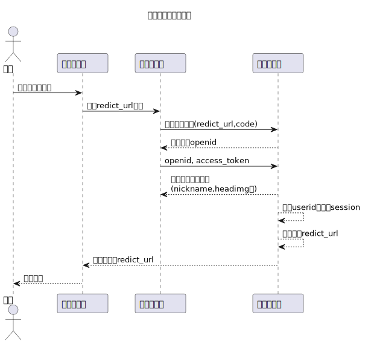
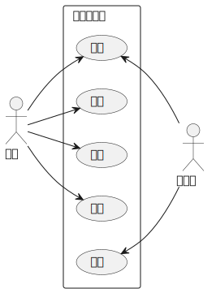
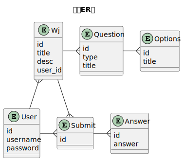
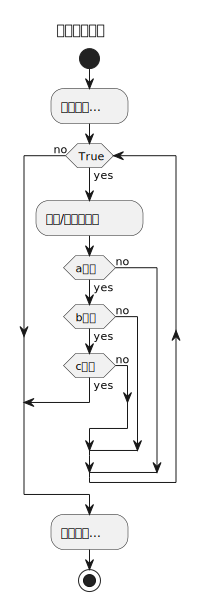
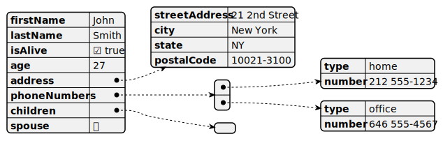
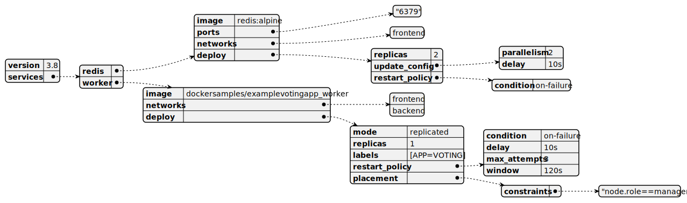

# PlantUML Test

> 使用 PlantUML 语法绘制各种图测试

## 时序图

- [01 微信公众号授权流程](code/test_sequence.puml)

  

## 用例图

- [01 测试用例图](code/test_usecase.puml)

  

## 类图

- [01 测试 ER 图](code/test_class.puml)

  

## 活动图

- [01 测试审批流程](code/test_activaty.puml)

  

## JSON

- [01 测试 Json](code/test_json.puml)

  

## Yaml

- [01 测试 Yaml](code/test_yaml.puml)

  
